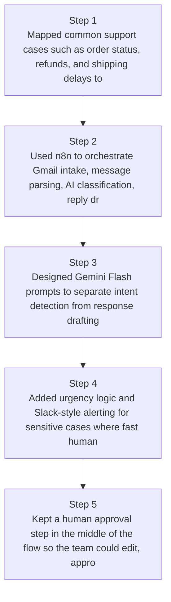
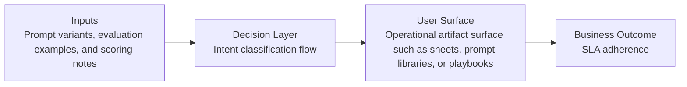
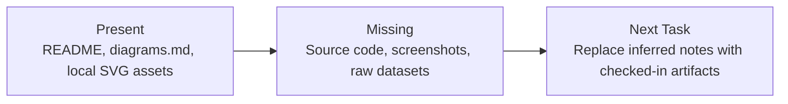

# Support Inbox Copilot Diagrams

Generated on 2026-04-26T04:29:37Z from README narrative plus project blueprint requirements.

## n8n workflow diagram

## Intent classification flow

## Evidence Gap Map

